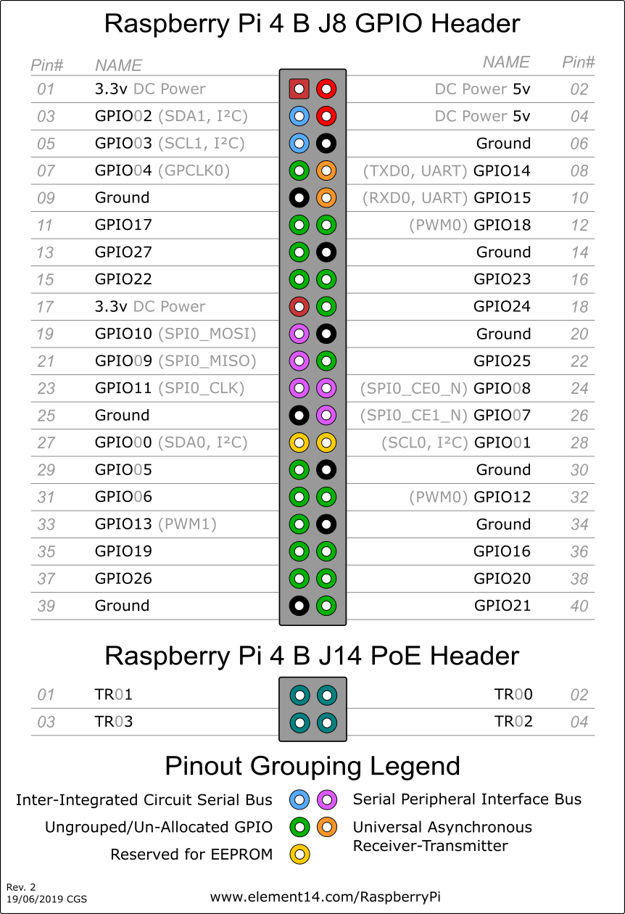
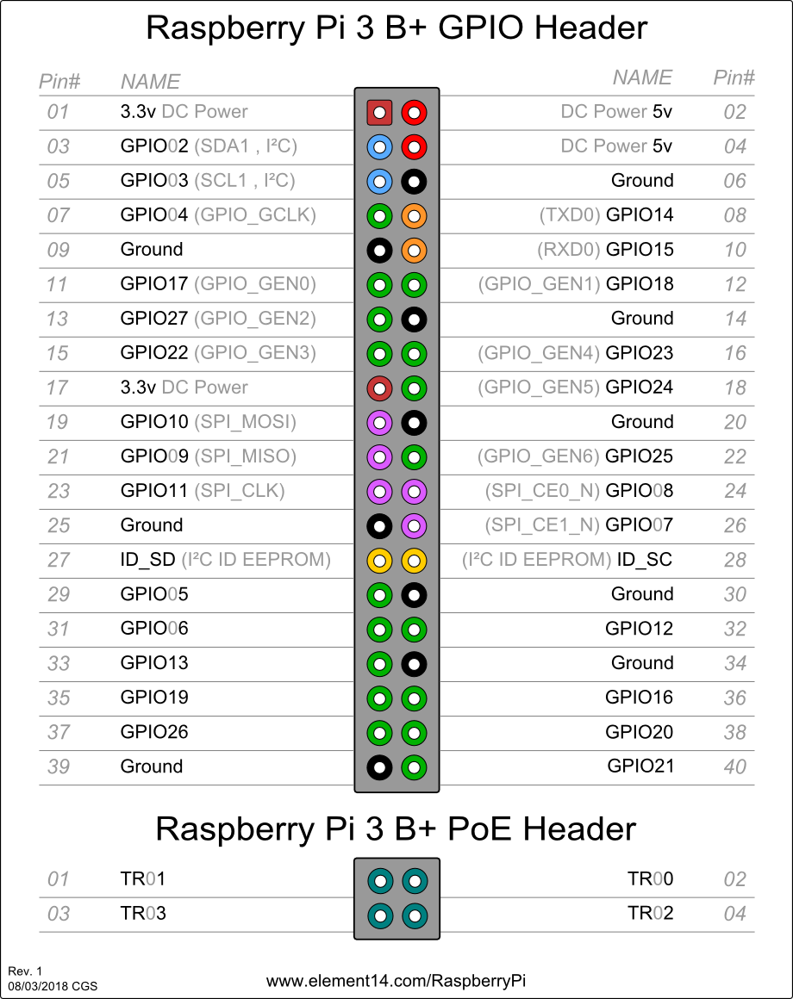
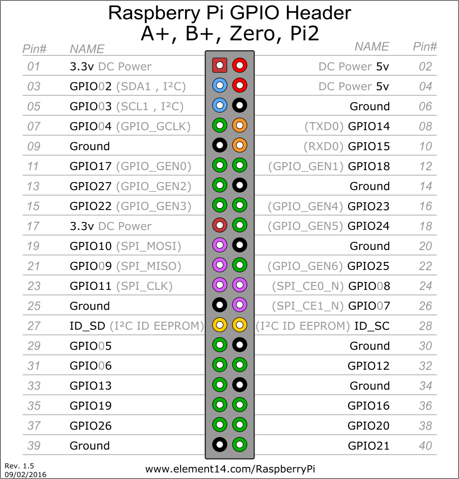

# Raspberry Pi 4のピン配置は3B+, 3, 2, B+, A+, Zero, Zero Wのどれも全部同じ。すごい！
設計思想を感じる。これがラズパイエコシステムだ！
## Raspberry Pi 4
- Ref. [1] https://www.element14.com/community/docs/DOC-92640/l/raspberry-pi-4-model-b-default-gpio-pinout-with-poe-header

## Raspberry Pi 3B+
- Ref. [2] https://www.element14.com/community/docs/DOC-88824/l/raspberry-pi-3-model-b-gpio-40-pin-block-poe-header-pinout

## Raspberry Pi 3, 2, B+, A+, Zero, Zero W 
- Ref. [3] https://www.element14.com/community/docs/DOC-80667/l/raspberry-pi-a-b-zero-zero-w-pi-2-pi-3-gpio-pinout

